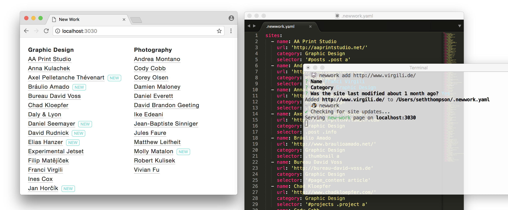
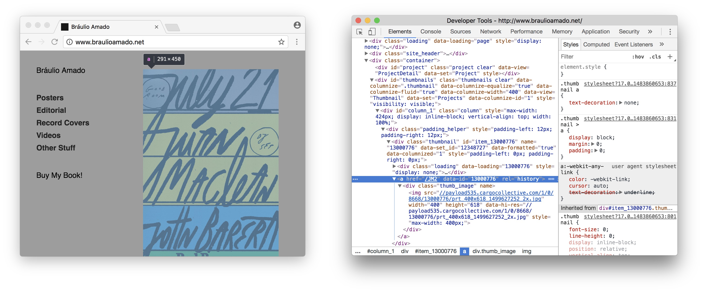

<h1 align="center">new-work</h1>

<h5 align="center">✨ Discover when artists post new work</h5>



## Features

**✨ Automagic**: Automatically checks artists' websites for new work. Works by looking at a site's `last-modified` HTTP header or by diffing a specific HTML element.

**📂 Organized**: Keeps track of artists in various categories via a simple YAML file with a CLI helper.

**⚡ Fast**: Fetches sites in parallel for fast and efficient updates.

## Installation

```sh
$ npm install new-work
```

## Usage

```txt
Usage: newwork <command> [options]

  Commands:
    <default>                   Run 'newwork serve'
    serve                       Scrape, update, and serve a new-work page
    build                       Scrape, update, and save a new-work page to disk
    print                       Scrape, update, and print a table to the terminal 
    add [url]                   Add an URL to your list of sites
    remove [url]                Remove an URL from your list of sites
    ls                          List all sites in your new-work page

  Available options:
    -i, --input <filename>      Input YAML file [default: ~/.newwork.yaml]
    -o, --output <filename>     Output HTML file [default: ./newwork.html]
    -l, --lockfile <filename>   Lockfile location [default: ~/.newwork.lock]
    -p, --port=<n>              Bind 'newwork serve' to a port [default: 3030]
    -h, --help                  Print usage
```

## Guide

1.  Run `newwork init` to create a new config file in your home directory (by default `~/.newwork.yaml`).

2.  Run `newwork add <url>` to add a site to track.

3.  Confirm the site's title / the artist's name.

4.  Optionally specify a category (e.g. 'Photography').

5.  If the site returns a `last-modified` header, you're done! Otherwise, you must manually specify an HTML element to diff for updates.

6.  Open the site with a web inspector such as Chrome DevTools Elements panel. Search for an HTML element that will change when the site is updated. The could be a thumbnail on the homepage, a menu of projects, or a blog post element.



7.  Specify a jQuery selector that will return the chosen element. For example, a link element inside a thumbnail with the class `thumb` may be referenced by the selector `.thumb a`. Only the first matched element will be used.

8.  Repeat for additional sites.

9.  Run `newwork` or `newwork serve` to open a list of all your sites. Sites that have been changed in the last 30 days are highlighted with a "new" tag.

## JS API

<!-- Generated by documentation.js. Update this documentation by updating the source code. -->

### status

Get the status of a list of sites to see whether new work has been posted.

**Parameters**

-   `sites` **[Array](https://developer.mozilla.org/en-US/docs/Web/JavaScript/Reference/Global_Objects/Array)&lt;[Object](https://developer.mozilla.org/en-US/docs/Web/JavaScript/Reference/Global_Objects/Object)>** 
    -   `sites.name` **[String](https://developer.mozilla.org/en-US/docs/Web/JavaScript/Reference/Global_Objects/String)** name of artist / title of site
    -   `sites.url` **[String](https://developer.mozilla.org/en-US/docs/Web/JavaScript/Reference/Global_Objects/String)** 
    -   `sites.category` **[String](https://developer.mozilla.org/en-US/docs/Web/JavaScript/Reference/Global_Objects/String)** 
    -   `sites.selector` **[String](https://developer.mozilla.org/en-US/docs/Web/JavaScript/Reference/Global_Objects/String)?** jQuery selector that will return an element to diff for changes
-   `lockfile` **[String](https://developer.mozilla.org/en-US/docs/Web/JavaScript/Reference/Global_Objects/String)** filename of lockfile to store previous diffs & metadata
-   `opts` **[Object](https://developer.mozilla.org/en-US/docs/Web/JavaScript/Reference/Global_Objects/Object)?** 
    -   `opts.expiration` **[Number](https://developer.mozilla.org/en-US/docs/Web/JavaScript/Reference/Global_Objects/Number)** duration in ms for which a given site is still "new", default ms in one month
-   `cb`  

### render

Render an HTML view of a list of sites, highlighting when new work has been posted.

**Parameters**

-   `sites` **[Array](https://developer.mozilla.org/en-US/docs/Web/JavaScript/Reference/Global_Objects/Array)&lt;[Object](https://developer.mozilla.org/en-US/docs/Web/JavaScript/Reference/Global_Objects/Object)>** 
    -   `sites.name` **[String](https://developer.mozilla.org/en-US/docs/Web/JavaScript/Reference/Global_Objects/String)** name of artist / title of site
    -   `sites.url` **[String](https://developer.mozilla.org/en-US/docs/Web/JavaScript/Reference/Global_Objects/String)** 
    -   `sites.category` **[String](https://developer.mozilla.org/en-US/docs/Web/JavaScript/Reference/Global_Objects/String)** 
    -   `sites.selector` **[String](https://developer.mozilla.org/en-US/docs/Web/JavaScript/Reference/Global_Objects/String)?** jQuery selector that will return an element to diff for changes
-   `lockfile` **[String](https://developer.mozilla.org/en-US/docs/Web/JavaScript/Reference/Global_Objects/String)** filename of lockfile to store previous diffs & metadata
-   `opts` **[Object](https://developer.mozilla.org/en-US/docs/Web/JavaScript/Reference/Global_Objects/Object)?** 
    -   `opts.template` **[Function](https://developer.mozilla.org/en-US/docs/Web/JavaScript/Reference/Statements/function)** template function to return str of HTML, given sites
    -   `opts.expiration` **[Number](https://developer.mozilla.org/en-US/docs/Web/JavaScript/Reference/Global_Objects/Number)** duration in ms for which a given site is still "new", default ms in one month
-   `cb`  

## License

[MIT](https://tldrlegal.com/license/mit-license)
